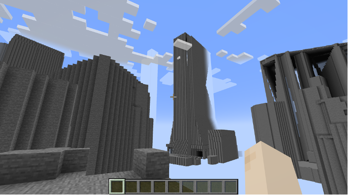

# plateau2minecraft



- PLATEAUのCityGMLをマインクラフトに取り込み可能なデータ形式に変換するためのツールです
  - MinecraftはMicrosoft社の商標です
  - また、本データはMicrosoft社及びMinecraft開発社のMojang Studiosの承認を得ているものではなく、Minecraft公式として提供するものではありません

## 注意事項

- 本プログラムで生成されたデータはMinecraft Java版 バージョン1.19.4のみで動作確認しています
- **統合版含め、上記バージョン以外のMinecraftでの動作は確認しておりません**
- 本手順書の作成・動作確認には細心の注意を払っておりますが、コマンドの実行等によるいかなる不具合、損害についても責任を負い兼ねます
- 統合版等、動作確認済以外の環境においてデータを利用したことによる不具合、損害についても責任を負い兼ねます
- データのご利用にあたっては、ご利用される方の責任において導入等を行ってください
- Minecraftそのものの遊び方やデータの活用方法についてはデータ提供者は対応することができませんので、ご了承ください
- Pythonのインストールなど、詳細な利用方法については、別途マニュアルを公開予定です
- 本リポジトリおよびソフトウェアは Project PLATEAU の参考資料として提供しているものです。動作の保証は行っておりません。
- 本リポジトリおよび本ソフトウェアの利用により生じた損失及び損害等について、開発者および国土交通省はいかなる責任も負わないものとします。
- 本リポジトリの内容は予告なく変更・削除する場合があります。

## 変換後データの仕様

本ツールでは、以下のような仕様のMinecraft上で実行可能なファイルが生成されます

- 生成されるブロックは一辺1mになっています
- 全てのデータはEPSG:3857に変換されます
- 高度300mを超えるような建物の場合、Minecraft側の高度制限によりブロックが生成されない可能性があります
- 処理負荷軽減のため、建物の内部は空洞化されています
- 全てのブロックは石（stone）として生成されます
- 建物などの底面は、必ずしも地上に接地しません
- デフォルトでLOD2の3Dデータを利用しますが、存在しない場合はLOD1の3Dデータを利用します
- LOD3以上のデータが存在していても、変換対象はLOD2以下となります。
- 複数のファイルを入力すると、複数まとめて変換されますが、コンピュータのリソースを大きく消費する、膨大な時間がかかるなどのデメリットもあります
- 建物以外にも交通・橋梁・都市設備・植生のデータを統合して変換可能ですが、PLATEAU仕様により標高が合わず、段差が出来るデータもあります
  - 例: 交通は2次元データ（つまり標高が0m）だが、建物は標高を持った3次元データのため、底面の高さが異なる

## システム要件

- 最小システム要件

  - なお、以下の要件では変換するCityGMLファイルのサイズによってはメモリー不足などによるエラーが発生する可能性があります。
  - プロセッサ: Intel Core i5-10300H
  - メモリー: 8 GB
  - ストレージ: 30 GB以上の空き容量
  - OS: Windows 11 Home Edition, Pro Edition
- 推奨システム要件

  - プロセッサ: Intel Core i9-10900KF
  - メモリー: 64 GB
  - ストレージ: 100GB以上の空き容量
  - OS: Windows 11 Home Edition, Pro Edition

## ユーザマニュアル

- ユーザマニュアルは[こちら](/docs/Minecraftワールドデータ作成マニュアル.pdf)から入手可能です。

## サンプルデータ

- [PLATEAU Kids Challenge  ～日本の街をマインクラフトで遊んでみよう！～](https://ascii20230821.peatix.com/)のイベントで利用された「西新宿」周辺エリアのワールドデータを[/world_data/](/world_data/)で配布しています。
  - [world_data/shinjuku_plateau.mcworld](world_data/shinjuku_plateau.mcworld)は統合版のワールドデータです
  - [world_data/world_data.zip](world_data/world_data.zip)はJava版のワールドデータです


※このデータは本ツールによって変換したデータに手作業で加工を加え、ディティールを追加したものになります。

## 利用方法

- リポジトリをclone

```bash
git clone https://github.com/MIERUNE/plateau2minecraft.git
```

- 移動

```bash
cd plateau2minecraft/
```

- CityGMLと出力先フォルダを指定して変換

```bash
poetry run python -m plateau2minecraft --target data/13100_tokyo23-ku_2022_citygml_1_2_op/udx/bldg/53393503_bldg_6697_2_op.gml --output data/output/
```

- 生成された `plateau2minecraft/data/output/world_data/region/`以下の.mcaファイルをMinecraftフォルダ内の `minecraft/saves/<your_world_name>/region/`フォルダ内に格納する
- Minecraft上で当該ワールドを開く

## 備考

- `src/plateau2minecraft/anvil`は[anvil-parser](https://github.com/WoutCherlet/anvil-parser)を利用しています
- `src/plateau2minecraft/earcut`は[earcut-py](https://github.com/MIERUNE/earcut-py)を利用しています

## ライセンス

- 本ソフトウェアは、MITライセンスのもとで提供されるオープンソースソフトウエアです。
- ソースコードおよび関連ドキュメントの著作権は国土交通省および開発者に帰属します。
- 本ソフトウェアの開発は[株式会社MIERUNE](https://www.mierune.co.jp/)が行っています。
